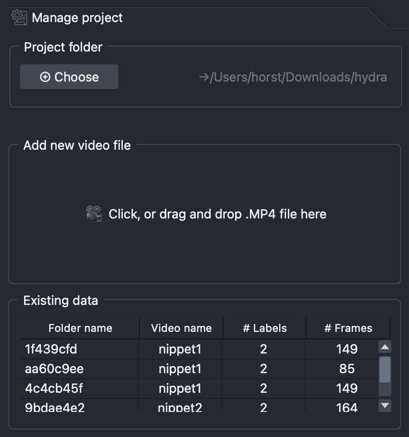

# Generate annotation data
To train your model you first need to show it what it should be tracking, i.e. you need to annotate the videos you want the model to train on. This is done in the **Generate annotation data** tab.

IMAGE: annotated overview of this section

## Model selection
Select the model you would like to use for your annotations and click *Load model*

??? question "Which model should I choose?"
    **SAM2 Base Plus:** details  
    **SAM2 Tiny:** details  
    **SAM2 Small:** details  
    **SAM2 Large:** details

## Create labels
This is where you create the labels for the animals/item/structure you want to track. 

1. In the *Type...* drop-down menu, select the type of annotation you would like to use to label your structure. There are two types:

    - **Points:** often the simplest and fastest. The model will automatically label what it thinks you want to track based on what you left-click on and exclude anything you right-click on. 
    - **Shapes:** recommended for labelling items that are not so easily created with the 'Points' type. Here you make an outline around the item to show the model what it should label.

2. In the *Label...* drop-down menu, select *Create* to open a dialogue box where you can name your label and click *Add* to add it. 

    Option:

    - **Suffix:** add a number here if you want to label multiple instances of the same thing (e.g. you have two LEDs and want to label them separately as *LED 1* and *LED 2*)

3. Click the *Create* button to create your label. Two new layers will appear in the left hand section of OCTRON (more on that later).

4. Repeat steps 1-3 until you have all the labels you want.

??? note "Removing unwanted labels"
    If you want to remove one of the labels you've created, then click *Remove* in the *Label...* drop-down menu and select the label you would like to remove

If at some point the model that is helping you annotate the videos is starting to slow down, you can click the **Reset** button to make it forget what it's learned so far and start fresh (more on that later).

<video width="100%"  muted controls>
  <source src="../assets/videos/tutorial/3__load_model_add _annotationlayers-fast.mp4" type="video/mp4">
  Your browser does not support the video tag.
</video>

### Start annotating
In the bottom left section of OCTRON you have a *layer list* of all your layers. When you click on a layer you'll get access to its *layer controls* in the panel directly above.

Each label that you created has two layers: one labelled by the layer type you selected (*points* or *shapes*) and one called *mask*. The points/shapes layer is the one you use to make annotations, while the mask layer is where you see the result of your annotations (i.e. what OCTRON has identified as an object based on your annotations). 

All layers can be toggled visible/invisible by clicking the 👁️ symbol on that layer.

1. Decide which frame to annotate first (e.g. the first frame where all the items you want to label are visible)

1. Click the video layer and make any adjustments necessary (e.g. adjust contrast).

2. Click on a points layer and make sure the ➕ symbol is selected in the layer controls panel. Use your mouse to left-click on the object you want to track - you should see a translucent mask appear covering that object. Right-click on anything that should not be included in that mask. The more clicks you make of both kinds, the more refined the mask becomes. The clicks do not have to be very precise.

    ??? note "How to remove unwanted points"
        If you make a mistake and would like to remove a point, click the ✖️ symbol in the layer controls and left-click on the point you would like to remove to delete it

3. Click on a shapes layer and select the type of shape you want to use in the layer controls, e.g. a square. Left-click and drag the shape around the object you want to label - OCTRON will automatically try to identify the structure you want to label within that square. 

    <video width="100%"  muted controls>
      <source src="../assets/videos/tutorial/4__oneclickannotations-fast.mp4" type="video/mp4">
      Your browser does not support the video tag.
    </video>

4. You can refine a shapes layer by using the tools shown in that layer's layer controls (e.g. remove/add/adjust points on the shape outline). 

5. If you want to switch the annotation type (e.g. from *points* to *shapes*), delete the mask layer associated with that annotation type by selecting it and clicking the 🗑️ symbol (both the mask and points layers will be removed), then add the layer again (step 1 under [Create labels](#create-labels))

    <video width="100%"  muted controls>
      <source src="../assets/videos/tutorial/5__changing_annotationlayermode-fast.mp4" type="video/mp4">
      Your browser does not support the video tag.
    </video>

6. Once you have annotated all the object you want to track in a single frame, you can get help from OCTRON to annotate the remaining frames (see [Batch prediction](#batch-prediction))

## Batch prediction
1. Click ▶️ to predict the next frame. The model you selected under *Model selection* will now create masks in the following frame, on what it thinks are the same objects as those you've annotated. 

    ??? note "What to do if the predicted masks look bad"
        If this happens then you need to refine the predicted mask. 

          - If you used the *points* label, then you just need to add a few more left- and right-clicks on the new frame to helpt the model recognise the object 
          - If you used the the *shapes* label it's often easiest to redraw the shape in the new frame 

2. If you're happy with the prediction, continue clicking ▶️ to see if the predictions continue to look good for the following frames, adjusting the masks if necessary

3. Once the predictions seem to be reliably good, click the *15 frames* button to predict 15 frames in a row. Once the predictions are finished, you can go back and adjust the masks if necessary; either individually if there's only one or two frames that are off, or just the first frame where the predictions went wrong and then try predicting 15 frames again from there (the new predictions will overwrite the old ones)

4. When predicting 15 frames in a row works well, then you can start to skip frames to speed up the process, especially if there is very little happening from frame to frame. If at some point you need to return to a previously annotated frame that was several frames away, you can use the timeline control to quickly move between them.

    - **Skip:** the number of frames you want to skip before predictions should be made again (this will apply both if you click ▶️ and if you click *15 frames*)
    - **Timeline control:** click *Jump to previous* or *Jump to next* to move to the closest preceding/upcoming annotated frame

5. Continue to predict frames until you reach the end of the video or a decent number of frames have been annotated

    ??? question "How do I know how many frames have been annotated?"
        Open the *Manage project* tab and look for the video you're currently annotating in the *Existing data* list. The last few characters of the folder and file names are visible in the first two columns, followed by the number of labels in each video, and the total number of frames that have been annotated.
        
        

    ??? question "How many frames should I annotate?"
        This depends on xyz

    ??? note "If the predictions become much slower than they were in the beginning"
         This sometimes happens when the model is basing its predictions on a large number of annotated frames. Click the **Reset** button under *Label manager* to make it forget what it's learned so far and then create annotations for all your labels in a single frame before you start predicting again.

<video width="100%"  muted controls>
  <source src="../assets/videos/tutorial/6_batchpredict-fast.mp4" type="video/mp4">
  Your browser does not support the video tag.
</video> 