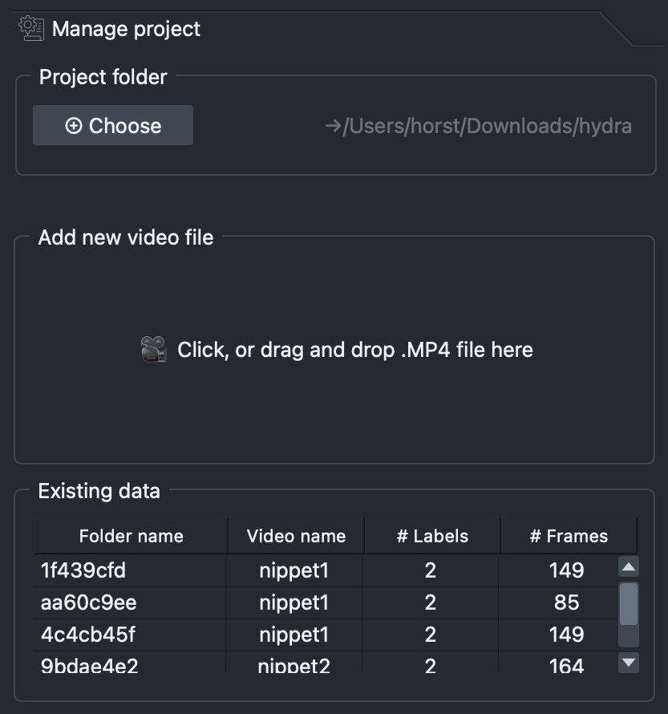

# Create a project
## Start by organising your project

1. Decide which videos to use and make sure they are .mp4 

    ??? question "How do I convert my video files to .mp4?"
        If your videos are not in mp4 format then you can use OCTRON to transcode them!

        1. Drag the folder containing the videos you want to transcode into the centre area of the OCTRON GUI.
        2. In the dialogue box that opens, make sure *OCTRON* is selected and click *OK*.
        3. OCTRON will identify the video files in that folder and let you select which ones to transcode. 
        
            Options: 

            - **Create subfolder:** Select this if you want the new .mp4 files to be saved in a subfolder to keep them separate from the originals.
            - **CRF** (constant rate factor): this value determines the quality of the .mp4 files. Lower values mean higher quality but also larger file size.

        4.  Click *OK* and open your terminal window to check on progress. As the files are transcoded you will see them pop up in your folder (or a *mp4_transcoded* subfolder within your forlder)

        <video width="100%"  muted controls>
           <source src="../assets/videos/tutorial/octron_tools_transcoding_movies_to_mp4-fast.mp4" type="video/mp4">
           Your browser does not support the video tag.
        </video>

2. Create a folder for your project
    
    ??? tip "Project folder tip"
        Within your project folder, create two subfolders:

        - **train:** save the videos that you want to train the model on in this folder. The number of videos you'll need for training depends on what you want to track, the quality of the data, recording duration, etc. Recommendation: start with a handful of videos and add more later if the training results are not good enough.
        - **test:** save the videos that you want to test the model on here (i.e. videos that the model has *not* been trained on). These should be new videos, but similar to the training videos in terms of image characteristics.

3. [Start the OCTRON Gui](gui.md)

4. In the **Manage project** tab, click *Choose* under *Project folder* and navigate to the folder you created in step 2

<video width="100%"  muted controls>
  <source src="../assets/videos/tutorial/1__startup_folder_select-fast.mp4" type="video/mp4">
  Your browser does not support the video tag.
</video>

## Add new video file
Drag one of the videos you want to train the model on into the *Add new video file* section under the **Manage project** tab. If the video is not located in the project folder, a dialogue box will pop up asking if you'd like to save a copy of the video in the project folder. It is highly recommended to click *Yes* to ensure all project related files are kept together. You will find the copied video in a subfolder called *videos* within your project folder.

<video width="100%"  muted controls>
  <source src="../assets/videos/tutorial/2__add_video_to_project-fast.mp4" type="video/mp4">
  Your browser does not support the video tag.
</video>

## Existing data
Once you start annotating, this section will list the number of frames that you have annotated in each video as well as the number of labels. 

